# [Car Simulator](https://jasonnor.github.io/Car-Simulator/)

Car Simulator use the fuzzy control system, genetic algorithm and particle swarm optimization to simulate the movement of the **autonomous car** on the map. It also support VR device, see [here](WebVR/) for details.

Input contains the three distance sensors of the car (front, 45 degrees left and right), which can be obtained from the defined motion equation, the position of car and the angle between the car and the horizontal axis. Output is the rotation angle of steering wheel.

The target is to reach the end line without encountering the wall and output the movement trajectory (including the position of each point in time, the sensor value and the rotation angle of steering wheel) as a text file, then display on the graphical interface.

The motion equation of the simulated car is as follows:

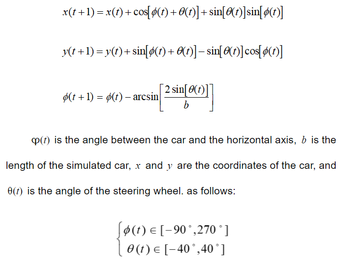

## Fuzzy Control System

Fuzzy control system use the custom seven fuzzy rules and discrete center of gravity defuzzifier. See [here](Fuzzy-Control-System/js/fuzzy.js) for the details.

## Genetic Algorithm

Car Simulator use the real-valued genetic algorithm (GA) to train the radial base function network (RBFN) and the car will control by RBFN. The gene is defined as the three parameters of RBFN (w, m, σ) of mixed dimension vector. The fitness function is the mean variance of the expected output of the data set and the RBFN output in the specific input case. The lowest fitness value is the best RBFN parameter.

The structure of the radial base function network is as follows:

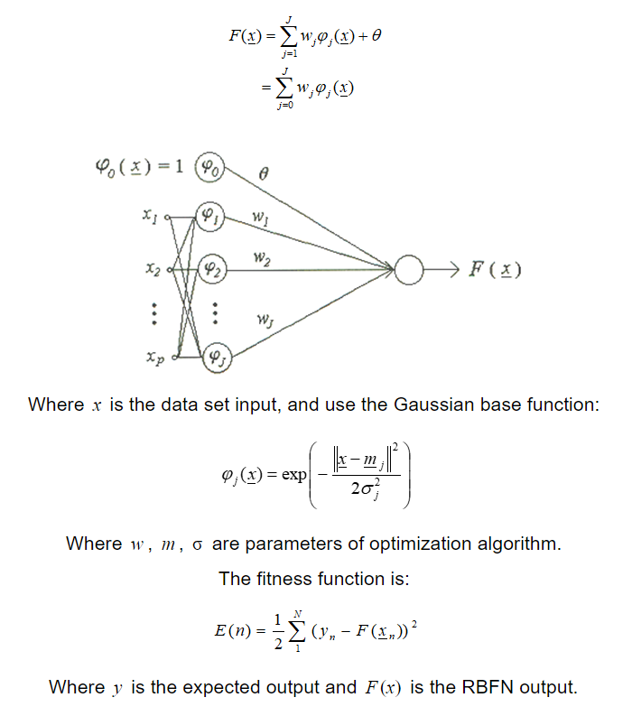

## Particle Swarm Optimization

Car Simulator can also use the particle swarm optimization (PSO) to train RBFN. The PSO coordinate is defined as the three parameters of RBFN (w, m, σ) of mixed dimension vector. The fitness function is the mean variance of the expected output of the data set and the RBFN output in the specific input case. The lowest fitness value is the best RBFN parameter.

## Getting Started

[https://jasonnor.github.io/Car-Simulator/](https://jasonnor.github.io/Car-Simulator/)

Car Simulator also support the VR device, please open this [page](https://jasonnor.github.io/Car-Simulator/WebVR).

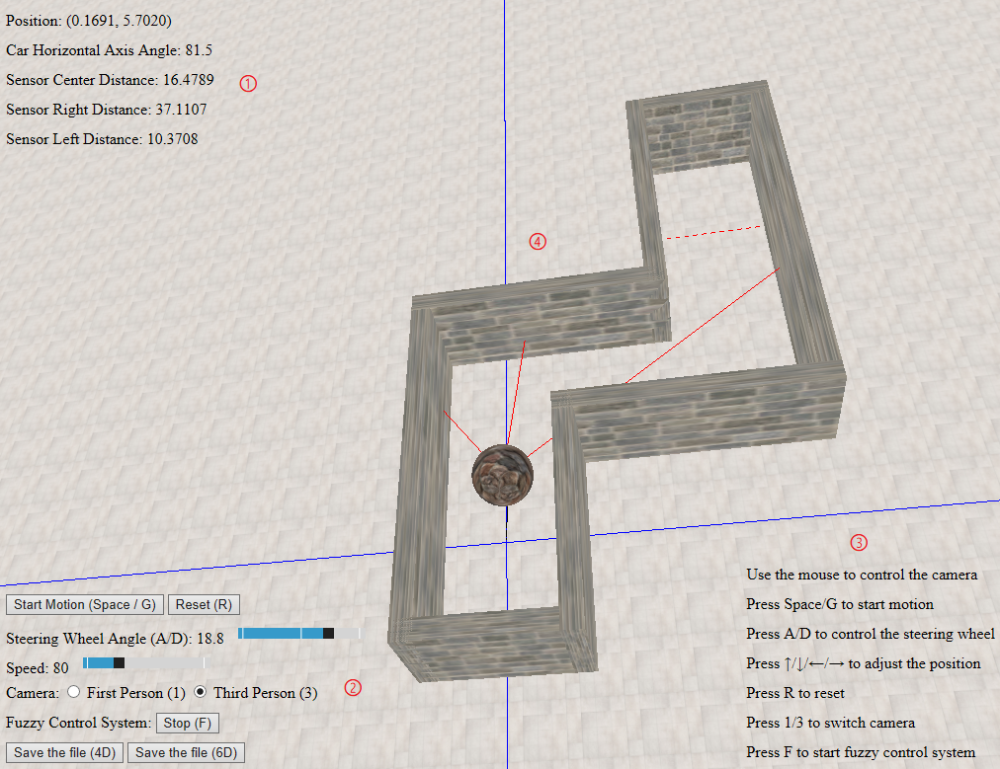

1. Status
2. Control button
3. Camera first person / third person switch
4. Rotation angle of steering wheel and moving speed
5. Start the fuzzy control system
6. RBFN parameters setting
7. GA parameters setting
8. PSO parameters setting
9. Save the trajectory and data
10. Operating instructions
11. Graphic interface

## Instructions

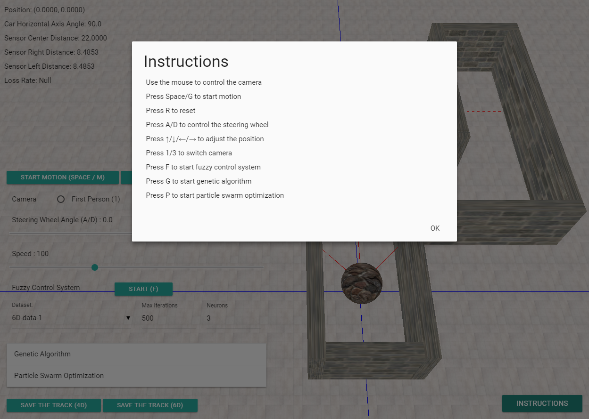

## 4-Dimensional Output Data Format

    InputA1 InputB1 InputC1 Output1
    InputA2 InputB2 InputC2 Output2
    ...

Where InputA is value of center distance sensor, InputB is value of right distance sensor, InputC is value of left distance sensor and output is rotation angle of steering wheel. The default datasets can be found [here](Genetic-Algorithm/dataset-4D).

## 6-Dimensional Output Data Format

    InputA1 InputB1 InputC1 InputD1 InputE1 Output1
    InputA2 InputB2 InputC2 InputD1 InputE1 Output2
    ...

Where InputA is X coordinate of the car, InputB is Y coordinate of the car, InputC is value of center distance sensor, InputD is value of right distance sensor, InputE is value of left distance sensor and output is rotation angle of steering wheel. The default datasets can be found [here](Genetic-Algorithm/dataset-6D).

## Preview

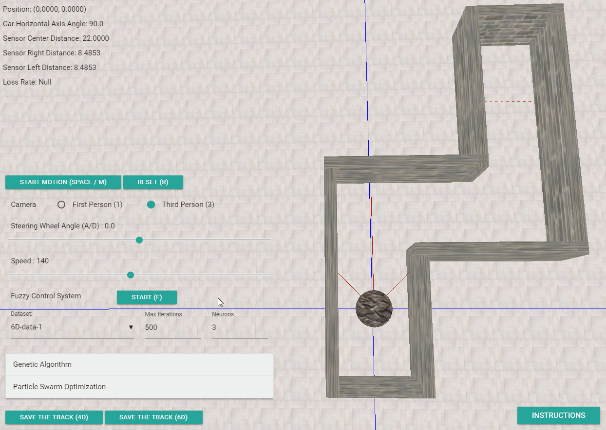

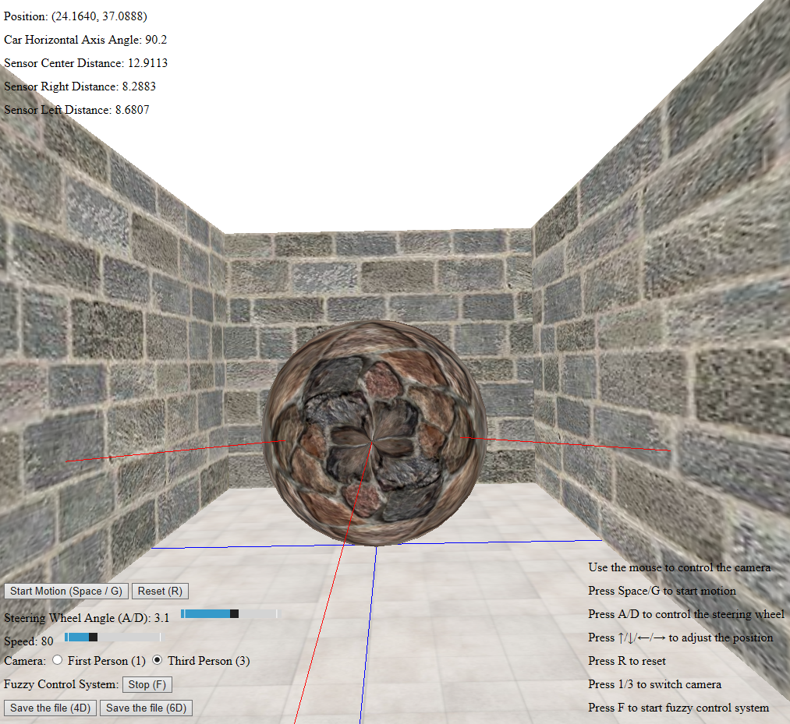

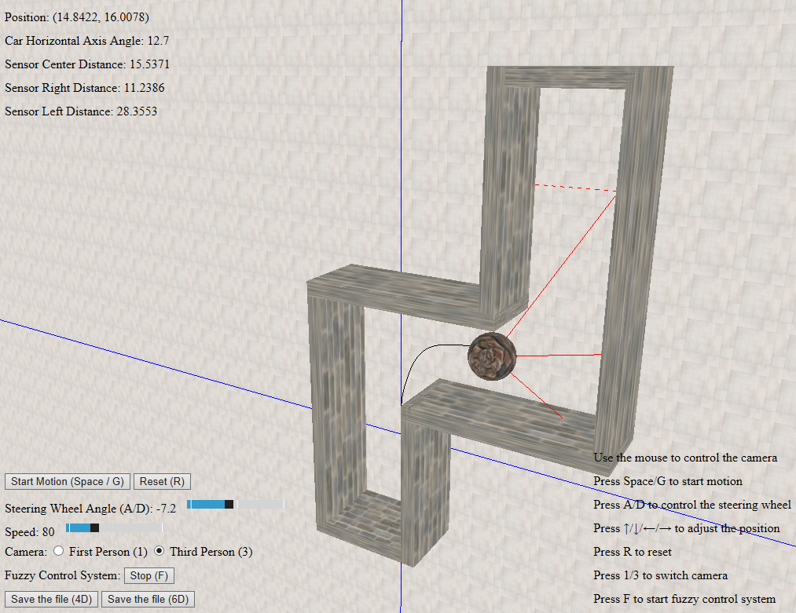

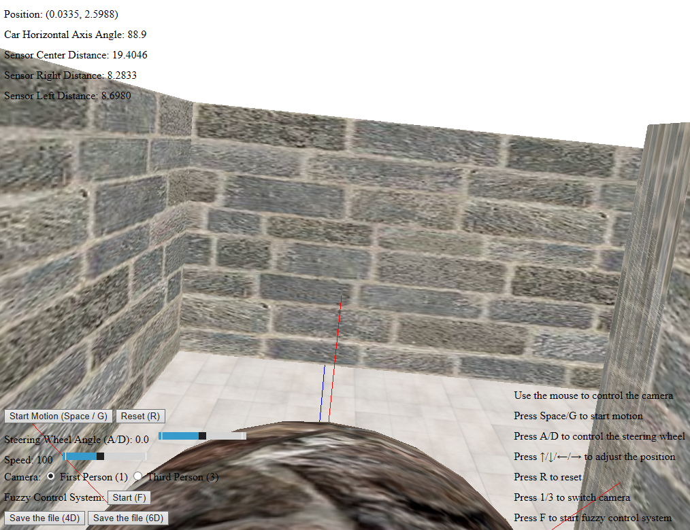

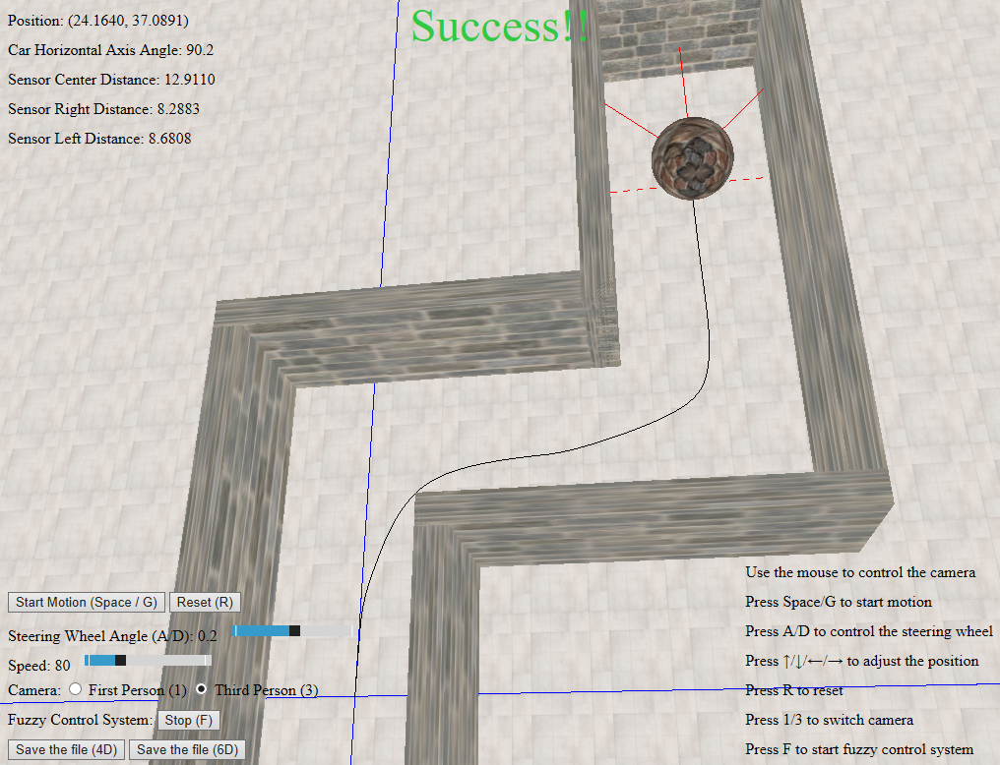

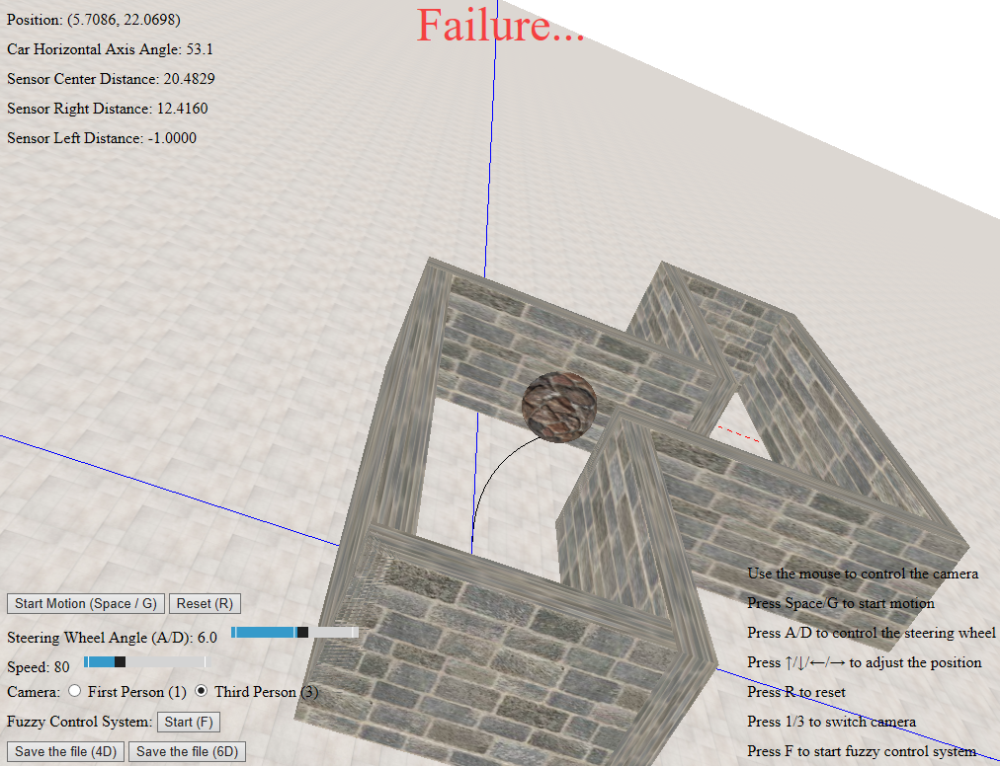

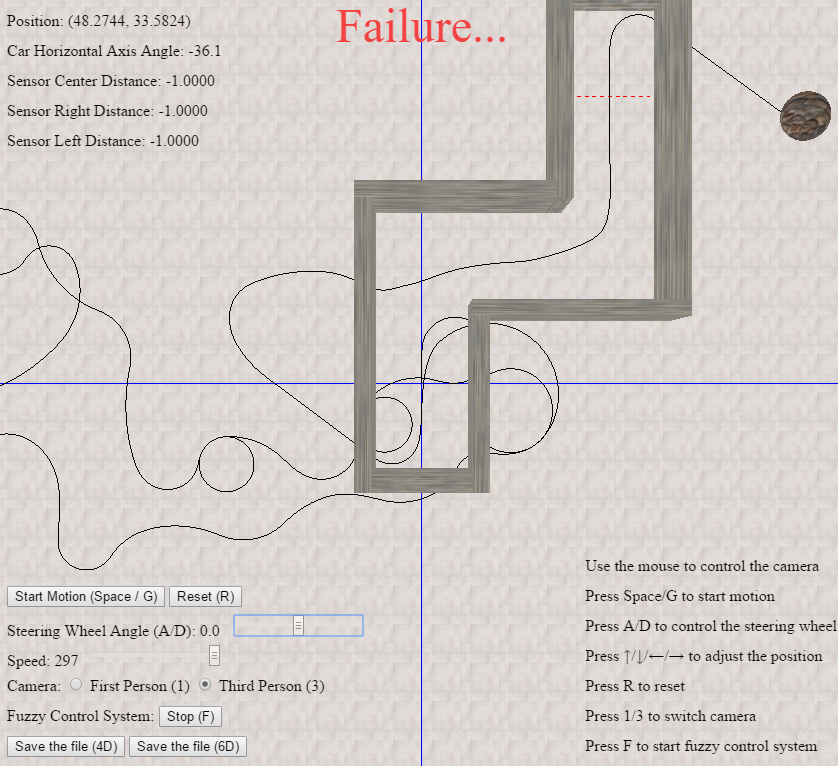

## Reference

+ three.js - [https://threejs.org/](https://threejs.org/)
+ FileSaver.js - [https://github.com/eligrey/FileSaver.js/](https://github.com/eligrey/FileSaver.js/)
+ Materialize - [http://materializecss.com/](http://materializecss.com/)

## Contributing

Please feel free to use it if you are interested in fixing issues and contributing directly to the code base.

## License

Car Simulator is released under the MIT license. See the [LICENSE](/LICENSE) file for details.
